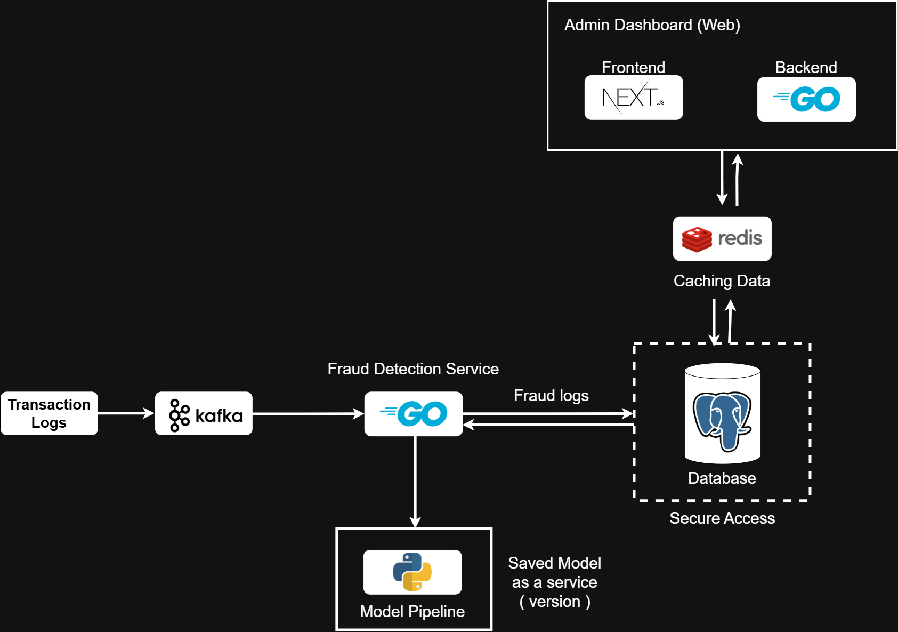

# 💳 Fraudulent Transaction Detection — (Repository-specific README)

Machine Learning project for detecting fraudulent financial transactions — built as part of the **Take-Home Test: Fraudulent Transaction Detection**.

This repository demonstrates an **end-to-end fraud detection pipeline**:
1. Exploratory Data Analysis (EDA)
2. Model Training and Evaluation
3. REST API for Fraud Prediction
4. Database Integration (SQLite)
5. System Architecture Design
6. Model Reproducibility

---

## 🧭 Overview

The goal of this project is to build a system that detects **fraudulent financial transactions** using machine learning and deploys it as a REST API service.

---

## 📁 Project Structure
```
Fraudulent-Transaction-Detection/
├── api.py                      # FastAPI app (entrypoint)
├── api_models.py               # Pydantic model (Transaction)
├── api_service.py              # โหลด pipeline / model (models/fraud_model.joblib)
├── database.py                 # SQLite + table definition
├── model_feature_engineer.py   # AccountFeatureEngineer (transformer)
├── models/
│   └── fraud_model.joblib      # trained pipeline (จำเป็น)
├── fraud_cases.db              # ตัวอย่าง DB
├── api_test.py                 # simple integration tests (requests)
├── requirement.txt             # dependencies
└── README.md                   # (this file)
```

---
## ⚙️ Environment Setup
### 1. Setup Instructions

#### Step 1: Clone this repository
```bash
git clone https://github.com/Tivapus/Fraudulent-Transaction-Detection.git
cd Fraudulent-Transaction-Detection
```

#### Step 2. Select Python Interpreter
1. Crtl + shift + p 
2. select Python: Select Interpreter

#### Step 3. Install dependencies
```bash
pip install -r requirement.txt
```
`requirement.txt` ใน repo ระบุ (โดยย่อ):  
`pandas, numpy, matplotlib, seaborn, joblib, scikit-learn, xgboost, torch, fastapi, uvicorn, pydantic, databases, SQLAlchemy`

### 2. Setup Database
```bash
python database.py
```
After command you need to see fraud_cases.db

### 3. Download fraud_mock.csv (Optional: If you want to run notebook again)
https://scbpocseasta001stdsbx.z23.web.core.windows.net/

add to floder /data

---

## 🧠 1. Exploratory Data Analysis (EDA)

### 📓 Notebook: notebooks/01_eda.ipynb

Exploration includes:
- Overview: Null values, data imbalance, and outlier analysis
- Features time_ind: hour_of_day,day
- Features transac_type
- Features is_fragged_fraud
- Features src_acc & dst_acc Analysis
- Features amount & src_bal & dst_bal 

### 📊 Key Findings
- Fraud mainly occurs in TRANSFER and CASH_OUT
- Fraudulent accounts often transfer nearly all their balance (src_ratio ≈ 1)
- Some balance fields contain inconsistencies → avoided to prevent leakage

---
## 🤖 2. Model Training & Evaluation
📓 Notebook: notebooks/02_model.ipynb
### **Data split**: 70% training, 30% testing (by time_ind)
### **Model**: XGBoostClassifier

### 🧩 Feature Engineering

**Selected safe features (no leakage)**: [
    'transac_type_CASH_IN',
    'transac_type_CASH_OUT',
    'transac_type_DEBIT', 
    'transac_type_PAYMENT',
    'transac_type_TRANSFER',
    'src_bal', 
    'dst_bal',
    'src_ratio', 
    'dst_ratio',
    'hour_of_day', 
    'day'
]

**Feature definitions**:
1. df['src_ratio'] = np.where(df['src_bal'] > 0, np.log1p(df['amount'] / df['src_bal']), 0)
2. df['dst_ratio'] = np.where(df['dst_bal'] > 0, np.log1p(df['amount'] / df['dst_bal']), 0)
3. df['hour_of_day'] = df['time_ind'] % 24
4. df['day'] = df['time_ind'] // 24

---

## 🌐 3. REST API Service
📂 src/app.py

Framework: FastAPI

### Endpoint
| Method | Endpoint   | Description                                                 |
| ------ | ---------- | ----------------------------------------------------------- |
| `POST` | `/predict` | Accepts JSON transaction input and returns fraud prediction |
| `GET`  | `/frauds`  | Retrieve stored flagged transactions                        |

### Run API Server
```bash 
python api.py
```

### `POST /predict`
- Input JSON format `api_models.Transaction` (in file `api_models.py`)
- Field:
  ```json
  {
    "time_ind": 100,
    "transac_type": "PAYMENT",
    "amount": 1500.75,
    "src_acc": "C123456",
    "dst_acc": "M789012",
    "src_bal": 20000.0,
    "src_new_bal": 18499.25,
    "dst_bal": 0.0,
    "dst_new_bal": 0.0,
    "is_flagged_fraud": 0
  }
  ```
- Response (ตัวอย่าง): 
    ```json
    {
        "is_predicted_fraud": result
    }
    ```
If the prediction is 1, the transaction is automatically stored in the SQLite database.

### `GET /frauds`
Retrieves all transactions previously predicted as fraudulent.

Response Example
```json
[
{
    "id": 1,
    "time_ind": 100,
    "transac_type": "TRANSFER",
    "amount": 200000.0,
    "src_acc": "C98765",
    "dst_acc": "M12345",
    "is_flagged_fraud": 0,
    "is_predicted_fraud": 1
}
]
```

### GET / (root)
Simple health check endpoint.

Response Example 
``` json
{"message": "Fraud Detection API is running. Go to /docs for Swagger UI."}
```

---
## 🧾 4. Database
Database file: fraud_cases.db
Technology: SQLite (local database)

Run for Create Database
```bash
python database.py
```

| Column             | Type  | Description                               |
| ------------------ | ----- | ----------------------------------------- |
| id                 | text  | Unique transaction identifier             |
| time_ind           | text  | Transaction time                          |
| transac_type       | text  | Transaction type                          |
| amount             | float | Transaction amount                        |
| src_acc            | text  | Customer initiating the transaction       |
| dst_acc            | text  | Transaction recipient                     |
| src_bal            | float | Initial balance (sender)                  |
| src_new_bal        | float | New balance (sender)                      |
| dst_new_bal        | float | New balance (recipient)                   |
| is_flagged_fraud   |  int  | Transactions flagged for illegal attempts |
| is_predicted_fraud |  int  | Transactions predicted from model         |


---

## 🏗️ 5. System Architecture


---

## 🔁 6. Model Reproducibility
```bash
# EDA
1. Go to notebook/01_EDA.ipynb
2. Select the python interpreter
3. Install dependencies
4. Run each cells follow the step upper to below

# Model training
1. Go to notebook/02_model.ipynb
2. Select the python interpreter
3. Install dependencies
4. Run each cells follow the step upper to below
```
